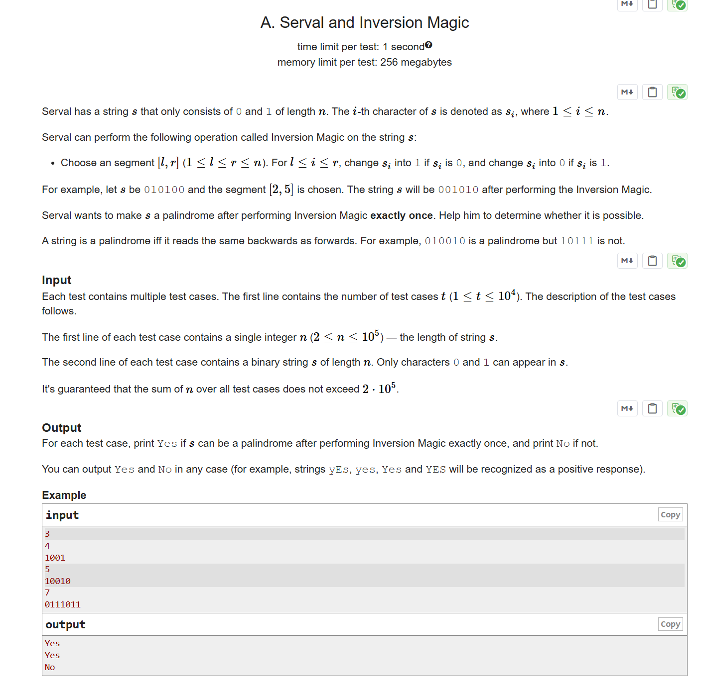

# A. Serval and Inversion Magic

# CF1789B Serval and Inversion Magic

## 题目描述

Serval 有一个只包含 $0$ 和 $1$ 的字符串 $s$，长度为 $n$。第 $i$ 个字符记为 $s_i$，其中 $1\leq i\leq n$。

Serval 可以对字符串 $s$ 执行如下操作，称为“反转魔法”：

- 选择一个区间 $[l, r]$（$1\leq l\leq r\leq n$）。对于 $l\leq i\leq r$，如果 $s_i$ 是 $0$，则将其变为 $1$；如果 $s_i$ 是 $1$，则将其变为 $0$。

例如，若 $s=010100$，选择区间 $[2,5]$，则执行反转魔法后 $s$ 变为 $001010$。

Serval 想要通过恰好执行一次反转魔法，使得 $s$ 变为回文串。请你帮他判断是否有可能。

一个字符串是回文串，当且仅当它正着读和反着读都相同。例如，$010010$ 是回文串，但 $10111$ 不是。

## 输入格式

每组测试数据包含多组测试用例。第一行包含一个整数 $t$（$1\leq t\leq 10^4$），表示测试用例的数量。

每组测试用例的第一行包含一个整数 $n$（$2\leq n\leq 10^5$），表示字符串 $s$ 的长度。

第二行包含一个长度为 $n$ 的二进制字符串 $s$，仅包含字符 $0$ 和 $1$。

保证所有测试用例中 $n$ 的总和不超过 $2\cdot 10^5$。

## 输出格式

对于每组测试用例，如果可以通过恰好一次反转魔法使 $s$ 变为回文串，输出 Yes，否则输出 No。

你可以用任意大小写形式输出 Yes 和 No（例如 yEs、yes、Yes、YES 都会被识别为肯定回答）。

## 输入输出样例 #1

### 输入 #1

```
3
4
1001
5
10010
7
0111011
```

### 输出 #1

```
Yes
Yes
No
```

## 说明/提示

在第一个测试用例中，Serval 可以对区间 $[1,4]$ 执行反转魔法，$s$ 变为 $0110$。

在第二个测试用例中，Serval 可以对区间 $[1,3]$ 执行反转魔法，$s$ 变为 $01110$。

在第三个测试用例中，Serval 无法通过恰好一次反转魔法将 $s$ 变为回文串。

> 英文原题：



