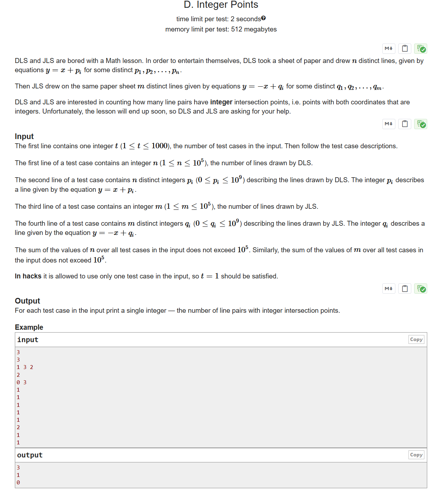

# CF1248A Integer Points

## 题目描述

DLS 和 JLS 在数学课上感到无聊。为了自娱自乐，DLS 拿出一张纸，画了 $n$ 条不同的直线，这些直线的方程为 $y = x + p_i$，其中 $p_1, p_2, \ldots, p_n$ 是互不相同的整数。

随后，JLS 在同一张纸上画了 $m$ 条不同的直线，这些直线的方程为 $y = -x + q_i$，其中 $q_1, q_2, \ldots, q_m$ 也是互不相同的整数。

DLS 和 JLS 想知道，有多少对直线的交点坐标都是整数（即横纵坐标均为整数）。可惜课程很快就要结束了，所以他们请求你帮忙计算。

## 输入格式

第一行包含一个整数 $t$（$1 \le t \le 1000$），表示测试用例的数量。接下来是每个测试用例的描述。

每个测试用例的第一行包含一个整数 $n$（$1 \le n \le 10^5$），表示 DLS 画的直线数量。

第二行包含 $n$ 个互不相同的整数 $p_i$（$0 \le p_i \le 10^9$），每个 $p_i$ 描述一条方程为 $y = x + p_i$ 的直线。

第三行包含一个整数 $m$（$1 \le m \le 10^5$），表示 JLS 画的直线数量。

第四行包含 $m$ 个互不相同的整数 $q_i$（$0 \le q_i \le 10^9$），每个 $q_i$ 描述一条方程为 $y = -x + q_i$ 的直线。

所有测试用例中 $n$ 的总和不超过 $10^5$，所有测试用例中 $m$ 的总和也不超过 $10^5$。

在 hack 数据中，只允许输入一个测试用例，即 $t=1$。

## 输出格式

对于每个测试用例，输出一个整数，表示具有整数交点的直线对的数量。

## 输入输出样例 #1

### 输入 #1

```
3
3
1 3 2
2
0 3
1
1
1
1
1
2
1
1
```

### 输出 #1

```
3
1
0
```

## 说明/提示

下图展示了样例第一个测试用例中的直线。黑色圆点表示坐标均为整数的交点。


> 英文原题：



