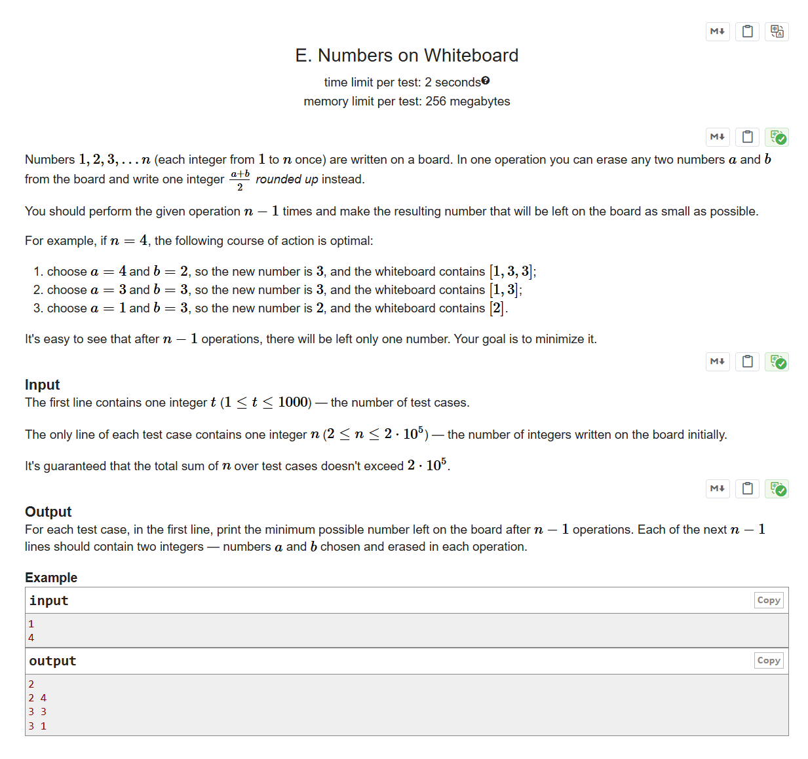

# CF1430C Numbers on Whiteboard

## 题目描述

在黑板上写有数字 $1, 2, 3, \dots, n$（每个整数从 $1$ 到 $n$ 各出现一次）。每次操作，你可以从黑板上任意擦去两个数字 $a$ 和 $b$，并写上一个新的整数 $\lceil \frac{a + b}{2} \rceil$（即 $\frac{a + b}{2}$ 向上取整）。

你需要进行 $n-1$ 次这样的操作，使得最后黑板上剩下的那个数字尽可能小。

例如，如果 $n = 4$，最优的操作过程如下：

1. 选择 $a = 4$ 和 $b = 2$，新数字为 $3$，黑板上变为 $[1, 3, 3]$；
2. 选择 $a = 3$ 和 $b = 3$，新数字为 $3$，黑板上变为 $[1, 3]$；
3. 选择 $a = 1$ 和 $b = 3$，新数字为 $2$，黑板上变为 $[2]$。

显然，经过 $n-1$ 次操作后，黑板上只会剩下一个数字。你的目标是让这个数字尽可能小。

## 输入格式

第一行包含一个整数 $t$（$1 \le t \le 1000$），表示测试用例的数量。

每个测试用例的唯一一行包含一个整数 $n$（$2 \le n \le 2 \times 10^5$），表示初始时黑板上的整数个数。

保证所有测试用例中 $n$ 的总和不超过 $2 \times 10^5$。

## 输出格式

对于每个测试用例，第一行输出经过 $n-1$ 次操作后黑板上可能剩下的最小数字。接下来的 $n-1$ 行，每行输出两个整数 $a$ 和 $b$，表示每次操作中被选择并擦去的两个数字。

## 输入输出样例 #1

### 输入 #1

```
1
4
```

### 输出 #1

```
2
2 4
3 3
3 1
```

## 说明/提示

> 英文原题：


