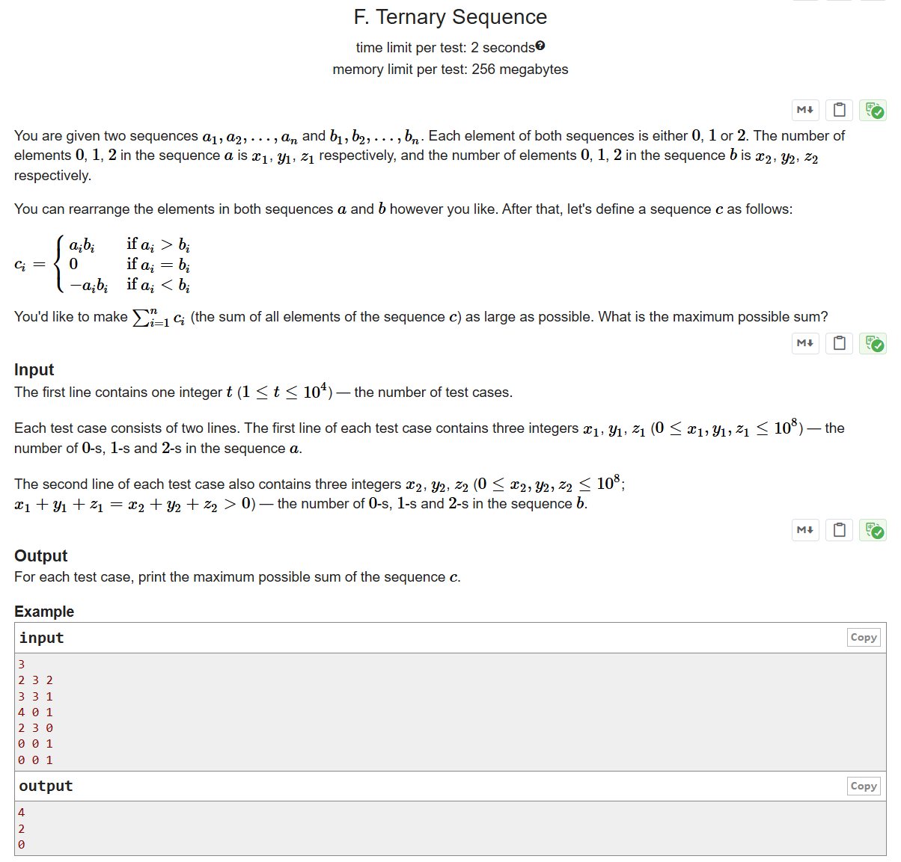

# CF1401B Ternary Sequence

## 题目描述

给定两个序列 $a_1, a_2, \dots, a_n$ 和 $b_1, b_2, \dots, b_n$，每个序列中的元素都是 $0$、$1$ 或 $2$。序列 $a$ 中 $0$、$1$、$2$ 的个数分别为 $x_1$、$y_1$、$z_1$，序列 $b$ 中 $0$、$1$、$2$ 的个数分别为 $x_2$、$y_2$、$z_2$。

你可以任意重新排列序列 $a$ 和 $b$ 的元素。之后，定义序列 $c$ 如下：(看下面图片)

$$
c_i = \begin{cases} 
a_i b_i & \text{如果 } a_i > b_i \\
0 & \text{如果 } a_i = b_i \\
- a_i b_i & \text{如果 } a_i < b_i
\end{cases}
$$


你希望使 $\sum_{i=1}^n c_i$（即序列 $c$ 所有元素之和）尽可能大。请问最大可能的和是多少？

## 输入格式

第一行包含一个整数 $t$（$1 \le t \le 10^4$），表示测试用例的数量。

每个测试用例包含两行。每个测试用例的第一行包含三个整数 $x_1, y_1, z_1$（$0 \le x_1, y_1, z_1 \le 10^8$），分别表示序列 $a$ 中 $0$、$1$、$2$ 的个数。

每个测试用例的第二行也包含三个整数 $x_2, y_2, z_2$（$0 \le x_2, y_2, z_2 \le 10^8$，且 $x_1 + y_1 + z_1 = x_2 + y_2 + z_2 > 0$），分别表示序列 $b$ 中 $0$、$1$、$2$ 的个数。

## 输出格式

对于每个测试用例，输出一个整数，表示序列 $c$ 的最大可能和。

## 输入输出样例 #1

### 输入 #1

```
3
2 3 2
3 3 1
4 0 1
2 3 0
0 0 1
0 0 1
```

### 输出 #1

```
4
2
0
```

## 说明/提示

在第一个样例中，一种最优方案为：

$a = \{2, 0, 1, 1, 0, 2, 1\}$

$b = \{1, 0, 1, 0, 2, 1, 0\}$

$c = \{2, 0, 0, 0, 0, 2, 0\}$

在第二个样例中，一种最优方案为：

$a = \{0, 2, 0, 0, 0\}$

$b = \{1, 1, 0, 1, 0\}$

$c = \{0, 2, 0, 0, 0\}$

在第三个样例中，唯一可能的方案为：

$a = \{2\}$

$b = \{2\}$

$c = \{0\}$

> 英文原题：


