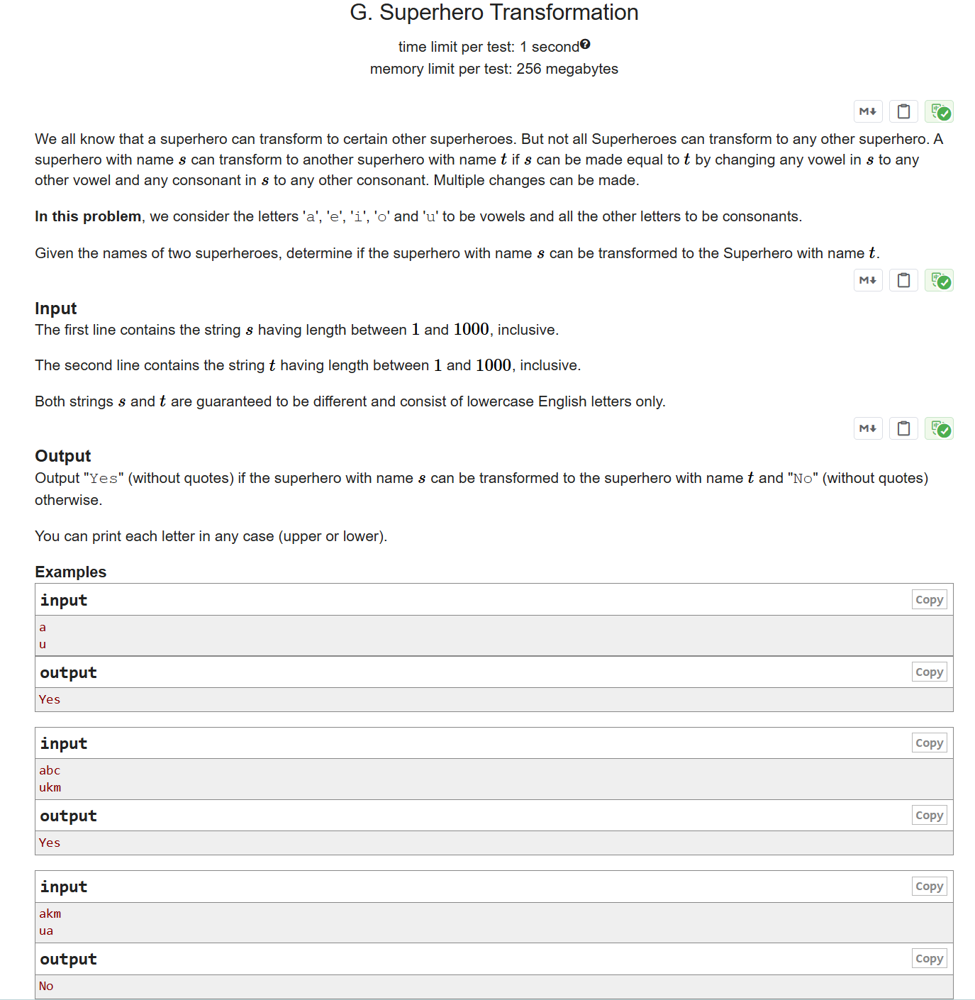

# CF1111A Superhero Transformation

## 题目描述

我们都知道超级英雄可以变身为某些其他超级英雄。但并不是所有超级英雄都能变身为任意其他超级英雄。一个名字为 $s$ 的超级英雄可以变身为另一个名字为 $t$ 的超级英雄，当且仅当通过将 $s$ 中的任意元音字母变为任意其他元音字母，以及将任意辅音字母变为任意其他辅音字母，可以使 $s$ 变为 $t$。可以进行多次更改。

在本题中，字母 'a'、'e'、'i'、'o' 和 'u' 被视为元音字母，其余所有字母均为辅音字母。

给定两个超级英雄的名字，判断名字为 $s$ 的超级英雄是否可以变身为名字为 $t$ 的超级英雄。

## 输入格式

第一行包含字符串 $s$，长度在 $1$ 到 $1000$ 之间（包含 $1$ 和 $1000$）。

第二行包含字符串 $t$，长度在 $1$ 到 $1000$ 之间（包含 $1$ 和 $1000$）。

保证 $s$ 和 $t$ 不相同，且均由小写英文字母组成。

## 输出格式

如果名字为 $s$ 的超级英雄可以变身为名字为 $t$ 的超级英雄，输出 "Yes"（不带引号）；否则输出 "No"（不带引号）。

输出时字母大小写均可。

## 输入输出样例 #1

### 输入 #1

```
a
u
```

### 输出 #1

```
Yes
```

## 输入输出样例 #2

### 输入 #2

```
abc
ukm
```

### 输出 #2

```
Yes
```

## 输入输出样例 #3

### 输入 #3

```
akm
ua
```

### 输出 #3

```
No
```

## 说明/提示

在第一个样例中，由于 'a' 和 'u' 都是元音字母，因此可以将字符串 $s$ 变为 $t$。

在第三个样例中，'k' 是辅音字母，而 'a' 是元音字母，因此无法将字符串 $s$ 变为 $t$。


> 英文原题：



