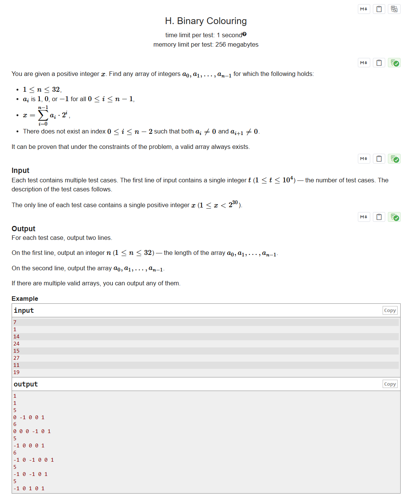

# CF1977B Binary Colouring

## 题目描述

给定一个正整数 $x$。请你找到任意一个整数数组 $a_0, a_1, \ldots, a_{n-1}$，满足以下条件：

- $1 \le n \le 32$；
- 对于所有 $0 \le i \le n - 1$，$a_i$ 只能取 $1$、$0$ 或 $-1$；
- $x = \displaystyle{\sum_{i=0}^{n - 1}{a_i \cdot 2^i}}$；
- 不存在 $0 \le i \le n - 2$ 使得 $a_{i} \neq 0$ 且 $a_{i + 1} \neq 0$。

可以证明，在本题的限制条件下，总是存在一个满足条件的数组。

## 输入格式

输入包含多组测试数据。第一行包含一个整数 $t$（$1 \le t \le 10^4$），表示测试用例的数量。接下来的每个测试用例包含一行，一个正整数 $x$（$1 \le x < 2^{30}$）。

## 输出格式

对于每个测试用例，输出两行。

第一行输出一个整数 $n$（$1 \le n \le 32$），表示数组 $a_0, a_1, \ldots, a_{n-1}$ 的长度。

第二行输出数组 $a_0, a_1, \ldots, a_{n-1}$。

如果存在多个满足条件的数组，你可以输出任意一个。

## 输入输出样例 #1

### 输入 #1

```
7
1
14
24
15
27
11
19
```

### 输出 #1

```
1
1
5
0 -1 0 0 1
6
0 0 0 -1 0 1
5
-1 0 0 0 1
6
-1 0 -1 0 0 1
5
-1 0 -1 0 1
5
-1 0 1 0 1
```

## 说明/提示

在第一个测试用例中，一个合法的数组为 $[1]$，因为 $(1) \cdot 2^0 = 1$。

在第二个测试用例中，一个可能的合法数组为 $[0, -1, 0, 0, 1]$，因为 $0 \cdot 2^0 + (-1) \cdot 2^1 + 0 \cdot 2^2 + 0 \cdot 2^3 + 1 \cdot 2^4 = -2 + 16 = 14$。


> 英文原题：



