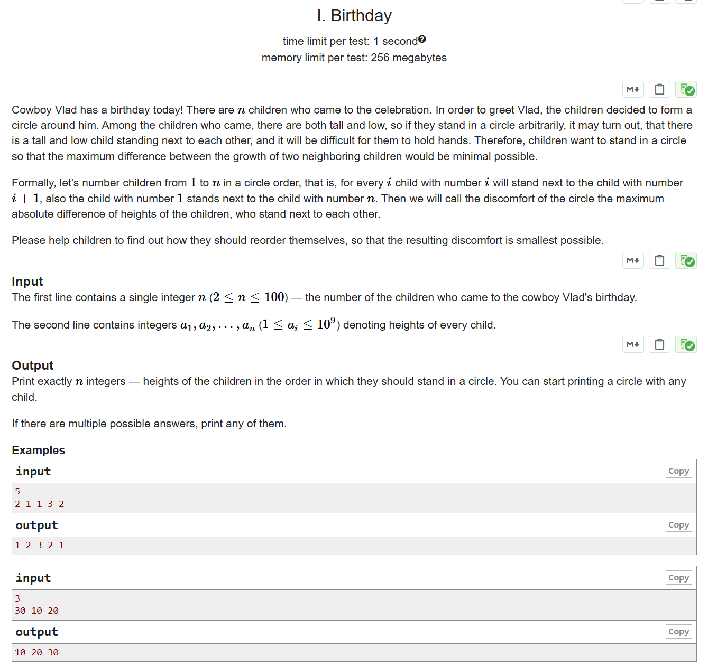

# CF1131C Birthday

## 题目描述

今天是牛仔 Vlad 的生日！有 $n$ 个孩子来参加庆祝活动。为了向 Vlad 表示祝贺，孩子们决定围成一个圈站在他周围。来参加的孩子中有高个子也有矮个子，如果他们随意站成一个圈，可能会出现高个子和矮个子站在一起的情况，这样他们就很难牵手。因此，孩子们希望站成一个圈，使得相邻两个孩子身高的最大差值尽可能小。

形式化地说，我们将孩子们按圆圈顺序编号为 $1$ 到 $n$，即对于每个 $i$，编号为 $i$ 的孩子与编号为 $i+1$ 的孩子相邻，同时编号为 $1$ 的孩子也与编号为 $n$ 的孩子相邻。我们将圆圈的不适度定义为相邻两个孩子身高的最大绝对差值。

请帮助孩子们重新排列站位，使得最终的不适度最小。

## 输入格式

第一行包含一个整数 $n$（$2 \leq n \leq 100$），表示来参加牛仔 Vlad 生日的孩子人数。

第二行包含 $a_1, a_2, \ldots, a_n$（$1 \leq a_i \leq 10^9$），表示每个孩子的身高。

## 输出格式

输出恰好 $n$ 个整数，表示孩子们按顺时针站成圆圈的顺序。你可以从任意一个孩子开始输出。

如果有多种方案，输出任意一种即可。

## 输入输出样例 #1

### 输入 #1

```
5
2 1 1 3 2
```

### 输出 #1

```
1 2 3 2 1
```

## 输入输出样例 #2

### 输入 #2

```
3
30 10 20
```

### 输出 #2

```
10 20 30
```

## 说明/提示

在第一个样例中，圆圈的不适度为 $1$，因为相邻孩子身高的绝对差分别为 $1$、$1$、$1$ 和 $0$。注意，序列 $[2, 3, 2, 1, 1]$ 和 $[3, 2, 1, 1, 2]$ 形成的是同一个圆圈，只是起点不同。

在第二个样例中，圆圈的不适度为 $20$，因为 $10$ 和 $30$ 的绝对差为 $20$。


> 英文原题：

