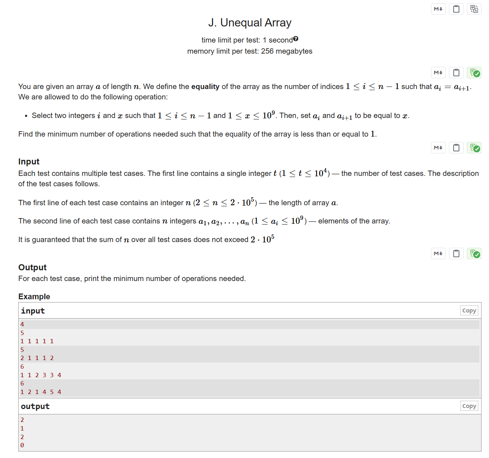

# CF1672C Unequal Array

## 题目描述

给定一个长度为 $n$ 的数组 $a$。我们定义数组的“相等性”为满足 $a_i = a_{i+1}$ 的下标 $1 \le i \le n-1$ 的个数。你可以进行如下操作：

- 选择两个整数 $i$ 和 $x$，其中 $1 \le i \le n-1$ 且 $1 \le x \le 10^9$，然后将 $a_i$ 和 $a_{i+1}$ 都赋值为 $x$。

请你求出最少需要多少次操作，使得数组的“相等性”小于等于 $1$。

## 输入格式

每组测试数据包含多组测试用例。第一行包含一个整数 $t$（$1 \leq t \leq 10^4$），表示测试用例的数量。接下来是每组测试用例的描述。

每组测试用例的第一行包含一个整数 $n$（$2 \le n \le 2 \cdot 10^5$），表示数组 $a$ 的长度。

第二行包含 $n$ 个整数 $a_1, a_2, \ldots, a_n$（$1 \le a_i \le 10^9$），表示数组的元素。

保证所有测试用例中 $n$ 的总和不超过 $2 \cdot 10^5$。

## 输出格式

对于每组测试用例，输出一个整数，表示所需的最小操作次数。

## 输入输出样例 #1

### 输入 #1

```
4
5
1 1 1 1 1
5
2 1 1 1 2
6
1 1 2 3 3 4
6
1 2 1 4 5 4
```

### 输出 #1

```
2
1
2
0
```

## 说明/提示

在第一个测试用例中，我们可以选择 $i=2$ 和 $x=2$，将数组变为 $[1, 2, 2, 1, 1]$。然后选择 $i=3$ 和 $x=3$，将数组变为 $[1, 2, 3, 3, 1]$。

在第二个测试用例中，我们可以选择 $i=3$ 和 $x=100$，将数组变为 $[2, 1, 100, 100, 2]$。


> 英文原题：


