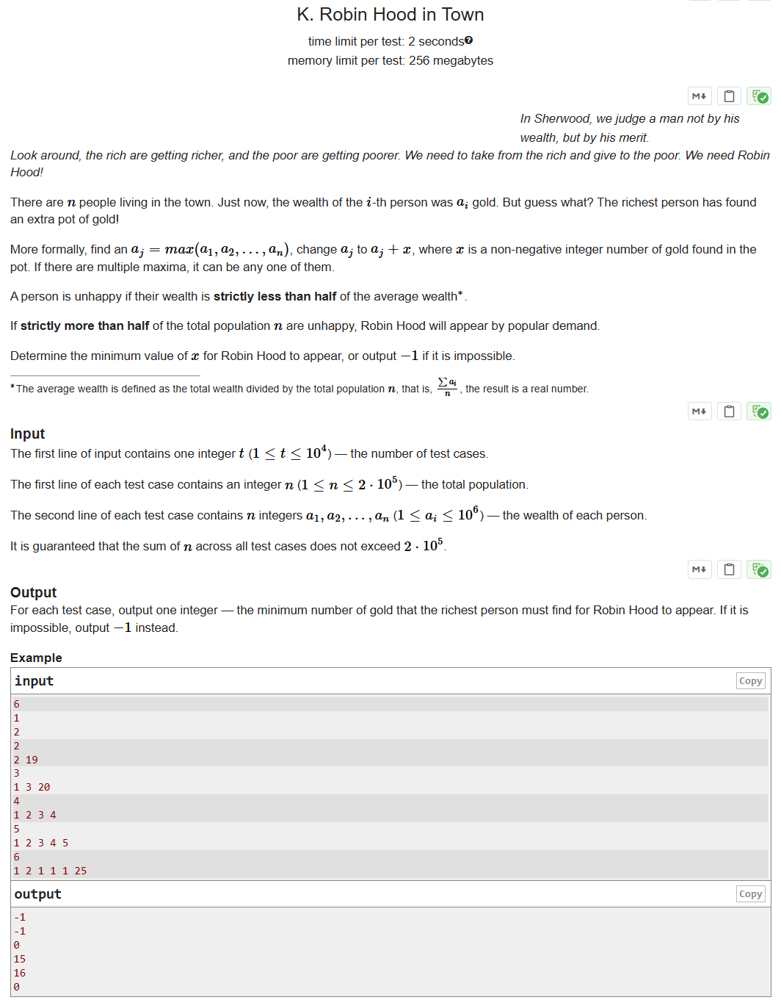

# CF2014C Robin Hood in Town

## 题目描述

在 Sherwood，我们评判一个人不是看他的财富，而是看他的品德。

看看四周，富人越来越富，穷人越来越穷。我们需要劫富济贫。我们需要 Robin Hood！

镇上有 $n$ 个人。此刻，第 $i$ 个人的财富为 $a_i$ 个金币。但你猜怎么着？最富有的人又发现了一锅额外的金币！

更正式地说，找到 $a_j = \max(a_1, a_2, \dots, a_n)$，将 $a_j$ 变为 $a_j + x$，其中 $x$ 是锅里发现的非负整数金币。如果有多个最大值，可以任选其中一个。

如果一个人的财富严格小于平均财富的一半 $^{\text{∗}}$，他就会感到不满。

如果严格超过一半的人口 $n$ 感到不满，Robin Hood 就会应民众要求出现。

请你确定 Robin Hood 出现所需的最小 $x$，如果不可能出现，则输出 $-1$。

$^{\text{∗}}$ 平均财富定义为总财富除以总人数 $n$，即 $\frac{\sum a_i}{n}$，结果为实数。

## 输入格式

输入的第一行包含一个整数 $t$（$1 \le t \le 10^4$）——测试用例的数量。

每个测试用例的第一行包含一个整数 $n$（$1 \le n \le 2\cdot10^5$）——总人口数。

每个测试用例的第二行包含 $n$ 个整数 $a_1, a_2, \ldots, a_n$（$1 \le a_i \le 10^6$）——每个人的财富。

保证所有测试用例中 $n$ 的总和不超过 $2 \cdot 10^5$。

## 输出格式

对于每个测试用例，输出一个整数——最富有的人需要再获得多少金币，Robin Hood 才会出现。如果不可能出现，输出 $-1$。

## 输入输出样例 #1

### 输入 #1

```
6
1
2
2
2 19
3
1 3 20
4
1 2 3 4
5
1 2 3 4 5
6
1 2 1 1 1 25
```

### 输出 #1

```
-1
-1
0
15
16
0
```

## 说明/提示

在第一个测试用例中，不可能有一个人感到不满。

在第二个测试用例中，总会有 $1$ 个快乐的人（最富有的）。

在第三个测试用例中，不需要额外的金币，所以答案是 $0$。

在第四个测试用例中，增加 $15$ 个金币后，平均财富变为 $\frac{25}{4}$，其一半为 $\frac{25}{8}$，此时有 $3$ 个人感到不满。

在第五个测试用例中，增加 $16$ 个金币后，平均财富变为 $\frac{31}{5}$，此时有 $3$ 个人感到不满。

> 英文原题：

