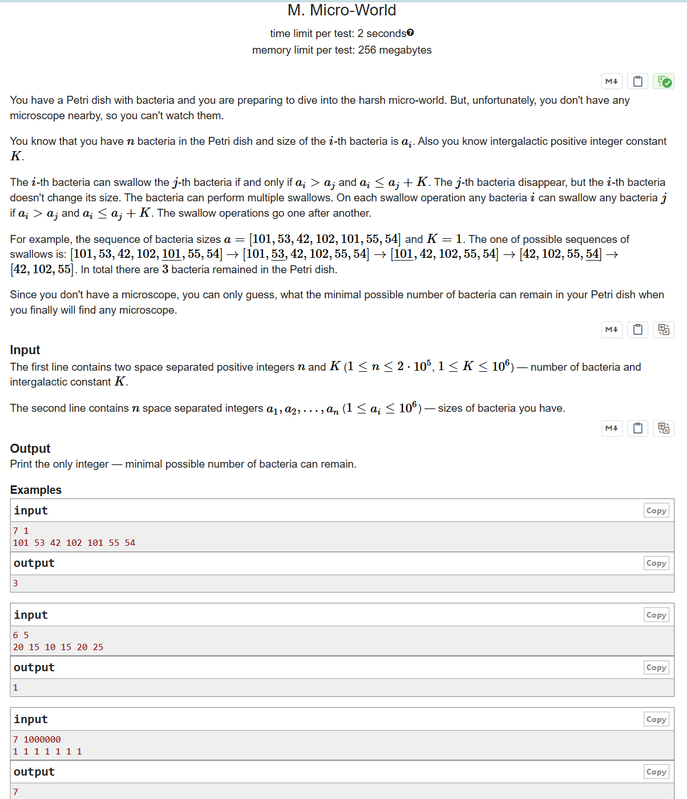

# CF990B Micro-World

## 题目描述

你有一个装有细菌的培养皿，准备进入严酷的微观世界。但不幸的是，你身边没有显微镜，所以你无法观察它们。

你知道培养皿中有 $n$ 个细菌，第 $i$ 个细菌的大小为 $a_i$。你还知道一个星际正整数常数 $K$。

第 $i$ 个细菌可以吞噬第 $j$ 个细菌，当且仅当 $a_i > a_j$ 且 $a_i \leq a_j + K$。被吞噬的第 $j$ 个细菌会消失，但第 $i$ 个细菌的大小不会发生变化。细菌可以进行多次吞噬操作。在每一次吞噬操作中，任意细菌 $i$ 都可以吞噬任意细菌 $j$，只要满足 $a_i > a_j$ 且 $a_i \leq a_j + K$。吞噬操作依次进行。

例如，细菌大小序列 $a=[101, 53, 42, 102, 101, 55, 54]$，$K=1$。一种可能的吞噬序列为：$[101, 53, 42, 102, \underline{101}, 55, 54] \to [101, \underline{53}, 42, 102, 55, 54] \to [\underline{101}, 42, 102, 55, 54] \to [42, 102, 55, \underline{54}] \to [42, 102, 55]$。最终培养皿中剩下 $3$ 个细菌。

由于你没有显微镜，你只能猜测，最终当你找到显微镜时，培养皿中可能剩下的最少细菌数量是多少。

## 输入格式

第一行包含两个用空格分隔的正整数 $n$ 和 $K$（$1 \leq n \leq 2 \times 10^5$，$1 \leq K \leq 10^6$），分别表示细菌的数量和星际常数 $K$。

第二行包含 $n$ 个用空格分隔的整数 $a_1, a_2, \dots, a_n$（$1 \leq a_i \leq 10^6$），表示每个细菌的大小。

## 输出格式

输出一个整数，表示最终可能剩下的最少细菌数量。

## 输入输出样例 #1

### 输入 #1

```
7 1
101 53 42 102 101 55 54
```

### 输出 #1

```
3
```

## 输入输出样例 #2

### 输入 #2

```
6 5
20 15 10 15 20 25
```

### 输出 #2

```
1
```

## 输入输出样例 #3

### 输入 #3

```
7 1000000
1 1 1 1 1 1 1
```

### 输出 #3

```
7
```

## 说明/提示

第一个样例已在题目描述中详细说明。

第二个样例中，一种最优的吞噬序列为：$[20, 15, 10, 15, \underline{20}, 25] \to [20, 15, 10, \underline{15}, 25] \to [20, 15, \underline{10}, 25] \to [20, \underline{15}, 25] \to [\underline{20}, 25] \to [25]$。

第三个样例中，没有任何细菌可以吞噬其他细菌。

> 英文原题：


