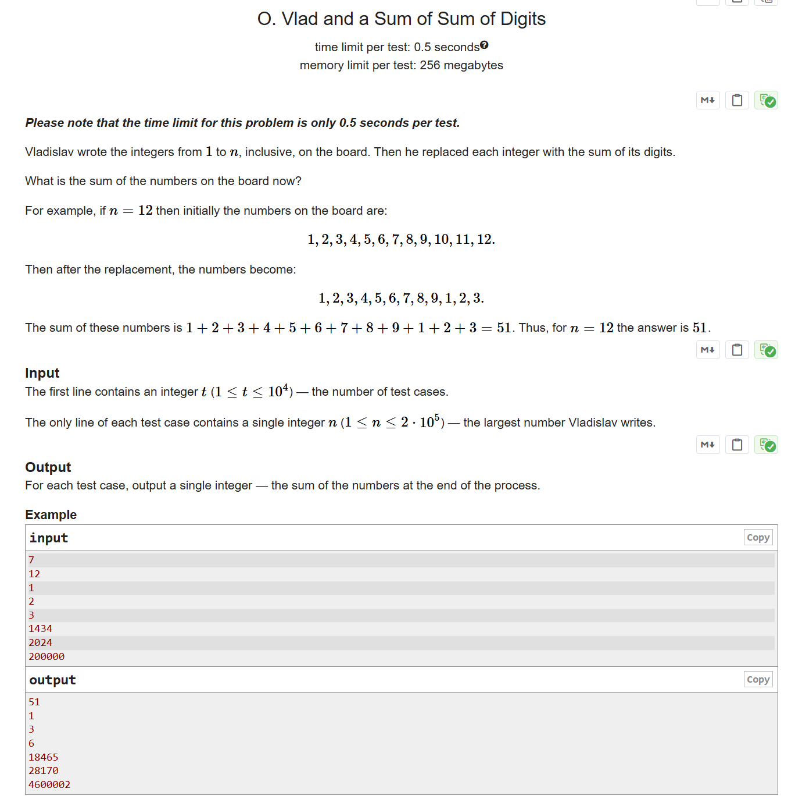

# CF1926C Vlad and a Sum of Sum of Digits

## 题目描述

请注意，本题每个测试点的时间限制仅为 $0.5$ 秒。

Vladislav 在黑板上写下了从 $1$ 到 $n$ 的所有整数。然后，他将每个整数替换为其各位数字之和。

现在，黑板上所有数字的总和是多少？

例如，如果 $n=12$，那么最初黑板上的数字为：$1, 2, 3, 4, 5, 6, 7, 8, 9, 10, 11, 12$。替换后，这些数字变为：$1, 2, 3, 4, 5, 6, 7, 8, 9, 1, 2, 3$。这些数字的和为 $1+2+3+4+5+6+7+8+9+1+2+3=51$。因此，当 $n=12$ 时，答案为 $51$。

## 输入格式

第一行包含一个整数 $t$（$1 \leq t \leq 10^4$），表示测试用例的数量。

每个测试用例的一行包含一个整数 $n$（$1 \leq n \leq 2 \cdot 10^5$），表示 Vladislav 写下的最大数字。

## 输出格式

对于每个测试用例，输出一个整数，表示最终黑板上所有数字的和。

## 输入输出样例 #1

### 输入 #1

```
7
12
1
2
3
1434
2024
200000
```

### 输出 #1

```
51
1
3
6
18465
28170
4600002
```

## 说明/提示


> 英文原题：



